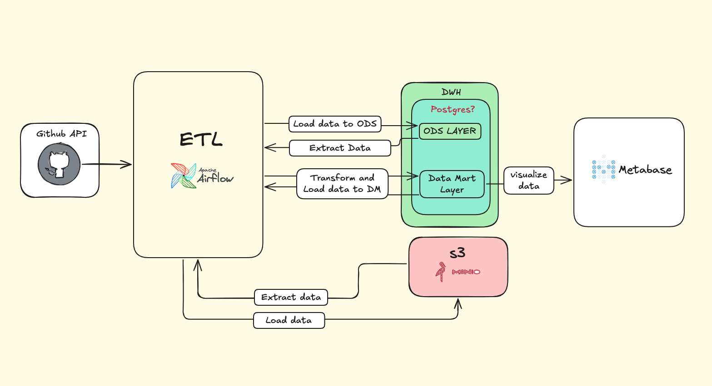
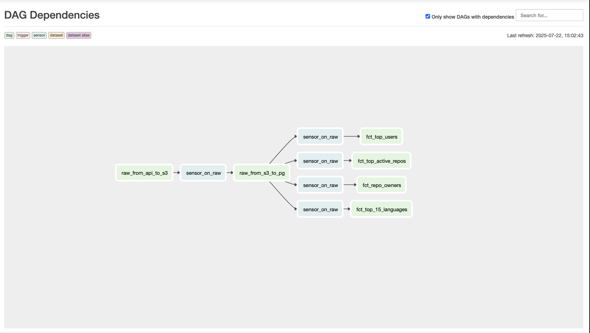

# GitHub API Data Pipeline

A comprehensive **ETL (Extract, Transform, Load) data pipeline** for collecting, processing, and analyzing GitHub repository data. This project demonstrates modern data engineering practices using Apache Airflow for orchestration, PostgreSQL for data warehousing, MinIO for object storage, and Metabase for business intelligence.

## 🏗️ Architecture

The pipeline follows a **multi-layered data architecture** with clear separation of concerns:

### System Architecture Overview



_The complete data flow from GitHub API through ETL processing to business intelligence visualization_

### Data Flow Layers

- **RAW Layer**: Raw data from GitHub API stored in Parquet format in MinIO (S3)
- **ODS Layer**: Operational Data Store with cleaned and structured data in PostgreSQL
- **DM Layer**: Data Marts with business-focused fact tables for analytics
- **BI Layer**: Metabase dashboards for data visualization and insights

### DAG Dependencies & Orchestration



### Result


_Airflow DAG dependency graph showing the orchestrated data pipeline flow_

The pipeline orchestration follows this dependency chain:

1. **`raw_from_api_to_s3`** - Daily extraction from GitHub API
2. **`raw_from_s3_to_pg`** - Load raw data into PostgreSQL ODS layer
3. **Parallel Analytics DAGs** - Generate business intelligence tables:
   - `fct_top_users` - Most active GitHub users
   - `fct_top_active_repos` - Highest activity repositories
   - `fct_repo_owners` - Repository ownership analysis
   - `fct_top_15_languages` - Programming language popularity

## 🚀 Features

- **🔄 Automated Daily ETL**: Scheduled data extraction from GitHub API
- **📊 Multi-dimensional Analytics**: Top repositories, languages, users, and owners analysis
- **🐳 Containerized Deployment**: Complete Docker Compose setup
- **📈 Business Intelligence**: Integrated Metabase for data visualization
- **🔧 Scalable Architecture**: CeleryExecutor with Redis for distributed processing
- **⚡ Incremental Processing**: Date-based processing with catchup capabilities
- **🛡️ Dependency Management**: ExternalTaskSensors for proper DAG orchestration

## 🛠️ Technology Stack

| Component                 | Technology              | Purpose                            |
| ------------------------- | ----------------------- | ---------------------------------- |
| **Orchestration**         | Apache Airflow 2.10.5   | Workflow management and scheduling |
| **Data Warehouse**        | PostgreSQL 13           | Structured data storage            |
| **Object Storage**        | MinIO                   | S3-compatible raw data storage     |
| **Message Broker**        | Redis                   | Celery task queue backend          |
| **Business Intelligence** | Metabase                | Data visualization and dashboards  |
| **Data Processing**       | Pandas + PyArrow        | Data transformation and analysis   |
| **Containerization**      | Docker + Docker Compose | Environment consistency            |

## 📋 Prerequisites

- **Docker** (>= 20.10.0)
- **Docker Compose** (>= 2.0.0)
- **GitHub Personal Access Token** (for API access)
- **4GB+ RAM** (recommended for Airflow)

## ⚙️ Installation & Setup

### 1. Clone the Repository

```bash
git clone https://github.com/yourusername/github-data-pipeline.git
cd github-data-pipeline
```

### 2. Environment Configuration

Create a `.env` file in the root directory:

```bash
# GitHub API Configuration
GITHUB_ACCESS_TOKEN=your_github_token_here
GITHUB_REQUEST_TIMEOUT=5

# MinIO Configuration
MINIO_ENDPOINT=minio:9000
MINIO_BUCKET=github-data
MINIO_ACCESS=minioadmin
MINIO_SECRET=minioadmin
MINIO_SECURE=false

# PostgreSQL Configuration
POSTGRES_DWH_CONN_ID=postgres_dwh

# Airflow Configuration
AIRFLOW_UID=50000
_AIRFLOW_WWW_USER_USERNAME=airflow
_AIRFLOW_WWW_USER_PASSWORD=airflow
```

### 3. Start the Services

```bash
# Initialize Airflow database and create admin user
docker-compose up airflow-init

# Start all services
docker-compose up -d
```

### 4. Access the Applications

| Service            | URL                   | Credentials             |
| ------------------ | --------------------- | ----------------------- |
| **Airflow Web UI** | http://localhost:8080 | airflow / airflow       |
| **Metabase**       | http://localhost:3000 | Setup on first visit    |
| **MinIO Console**  | http://localhost:9001 | minioadmin / minioadmin |

## 📈 Business Intelligence Setup

### Metabase Configuration

After starting the services, configure Metabase to connect to your data warehouse:

1. **Initial Setup**: Visit http://localhost:3000 and complete the setup wizard
2. **Database Connection**: Add PostgreSQL database with these settings:
   - **Host**: `postgres_dwh`
   - **Port**: `5432`
   - **Database name**: `postgres`
   - **Username**: `postgres`
   - **Password**: `postgres`
3. **Explore Data**: Navigate to the `dm` schema to find your analytics tables
4. **Create Dashboards**: Build visualizations from the fact tables

### Available Analytics Tables

Once your pipeline runs successfully, you'll have access to these business intelligence tables:

- **`dm.fct_top_active_repos`** - Top 50 repositories by activity score
- **`dm.fct_top_15_languages`** - Programming language popularity rankings
- **`dm.fct_top_users`** - Most active GitHub users
- **`dm.fct_repo_owners`** - Repository ownership statistics

## 📊 Data Pipeline Overview

### DAGs (Directed Acyclic Graphs)

#### 1. `raw_from_api_to_s3`

- **Purpose**: Extract daily GitHub repositories data
- **Schedule**: Daily at 12:00 UTC
- **Process**:
  - Fetches 1000 repositories per day from GitHub API
  - Processes data with Pandas
  - Stores as compressed Parquet files in MinIO

#### 2. `raw_from_s3_to_pg`

- **Purpose**: Load raw data into PostgreSQL ODS layer
- **Dependencies**: Waits for `raw_from_api_to_s3` completion
- **Process**:
  - Reads Parquet files from MinIO
  - Creates database schemas (stg, ods, dm)
  - Loads data into `ods.github_repos` table

#### 3. `fct_top_active_repos`

- **Purpose**: Generate top 50 most active repositories
- **Business Logic**: Ranks repositories by activity score (stars + watchers + forks)
- **Dependencies**: Waits for `raw_from_s3_to_pg` completion

#### 4. `fct_top_15_languages`

- **Purpose**: Analyze top 15 programming languages by repository count
- **Output**: Language popularity statistics and trends
- **Dependencies**: Waits for `raw_from_s3_to_pg` completion

#### 5. `fct_top_users`

- **Purpose**: Identify most active GitHub users
- **Metrics**: User activity based on repository count and engagement
- **Dependencies**: Waits for `raw_from_s3_to_pg` completion

#### 6. `fct_repo_owners`

- **Purpose**: Repository ownership analysis
- **Insights**: Most productive GitHub users and organizations by repository ownership
- **Dependencies**: Waits for `raw_from_s3_to_pg` completion

## 🗄️ Database Schema

### ODS Layer: `ods.github_repos`

| Column             | Type      | Description                        |
| ------------------ | --------- | ---------------------------------- |
| `repo_id`          | BIGINT    | GitHub repository ID (Primary Key) |
| `name`             | TEXT      | Repository name                    |
| `full_name`        | TEXT      | Full repository name (owner/repo)  |
| `language`         | TEXT      | Primary programming language       |
| `stargazers_count` | INT       | Number of stars                    |
| `watchers_count`   | INT       | Number of watchers                 |
| `forks_count`      | INT       | Number of forks                    |
| `open_issues`      | INT       | Number of open issues              |
| `owner_login`      | TEXT      | Repository owner username          |
| `owner_type`       | TEXT      | Owner type (User/Organization)     |
| `owner_id`         | BIGINT    | Owner GitHub ID                    |
| `visibility`       | TEXT      | Repository visibility              |
| `private`          | BOOLEAN   | Is repository private              |
| `license_name`     | TEXT      | License type                       |
| `created_at`       | TIMESTAMP | Repository creation date           |
| `updated_at`       | TIMESTAMP | Last update date                   |
| `pushed_at`        | TIMESTAMP | Last push date                     |
| `ingested_at`      | TIMESTAMP | Data ingestion timestamp           |

### DM Layer: Business Intelligence Tables

- `dm.fct_top_active_repos` - Top repositories by activity
- `dm.fct_top_languages` - Programming language statistics
- `dm.fct_top_users` - Most active users
- `dm.fct_repo_owners` - Repository ownership analysis

## 🔧 Configuration

### Airflow Connections

The pipeline automatically configures the following connections:

- **postgres_dwh**: PostgreSQL data warehouse connection
- **minio**: S3-compatible object storage connection

### Customization Options

- **API Rate Limiting**: Adjust `GITHUB_REQUEST_TIMEOUT` for API request intervals
- **Data Retention**: Modify date ranges in DAG configurations
- **Resource Allocation**: Update Docker Compose memory/CPU limits

## 📈 Monitoring & Observability

### Airflow Features

- **Task Success/Failure Tracking**: Monitor pipeline health in Airflow UI
- **Retry Logic**: Automatic retry with exponential backoff
- **Email Alerts**: Configure SMTP settings for notifications
- **Task Dependencies**: Visual DAG representation

### Logging

- **Centralized Logs**: All task logs stored in `./logs/` directory
- **Structured Logging**: JSON formatted logs for easy parsing
- **Log Rotation**: Automatic cleanup of old log files

## 🚀 Future Enhancements

### Planned Features

- [ ] **Data Quality Checks**: Great Expectations integration
- [ ] **CI/CD Pipeline**: GitHub Actions for automated testing
- [ ] **Real-time Processing**: Kafka integration for streaming data
- [ ] **Advanced Analytics**: dbt for complex transformations
- [ ] **Kubernetes Deployment**: Helm charts for production deployment

### Scalability Improvements

- [ ] **Partitioning**: Date-based table partitioning for better performance
- [ ] **Caching**: Redis caching for frequently accessed data
- [ ] **Data Lake**: Delta Lake integration for ACID transactions

## 🤝 Contributing

1. Fork the repository
2. Create a feature branch (`git checkout -b feature/amazing-feature`)
3. Commit your changes (`git commit -m 'Add amazing feature'`)
4. Push to the branch (`git push origin feature/amazing-feature`)
5. Open a Pull Request

## 📝 License

This project is licensed under the MIT License - see the [LICENSE](LICENSE) file for details.

## 🙏 Acknowledgments

- **Apache Airflow Community** for the excellent orchestration platform
- **GitHub API** for providing comprehensive repository data
- **MinIO Team** for the S3-compatible object storage solution
- **Metabase** for the intuitive BI platform

---

**Built with ❤️ by [Your Name]**

_This project demonstrates modern data engineering practices and serves as a reference implementation for building scalable ETL pipelines._
